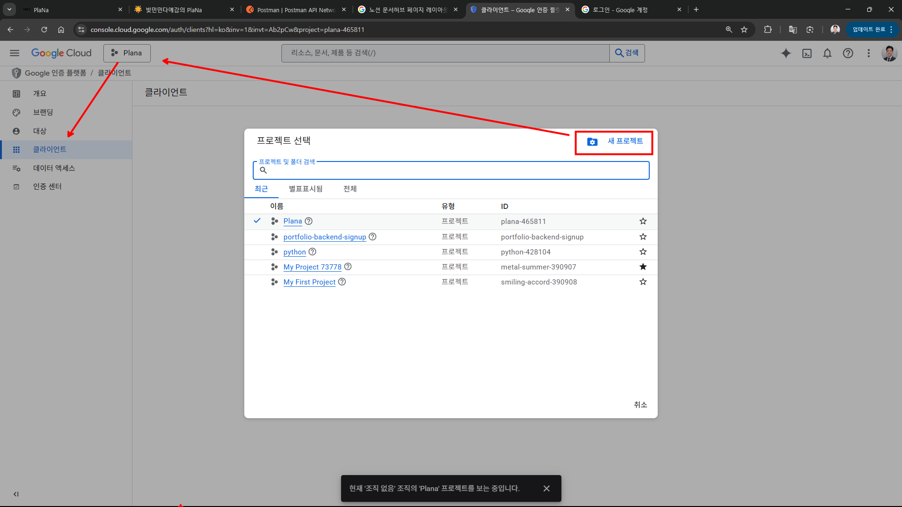
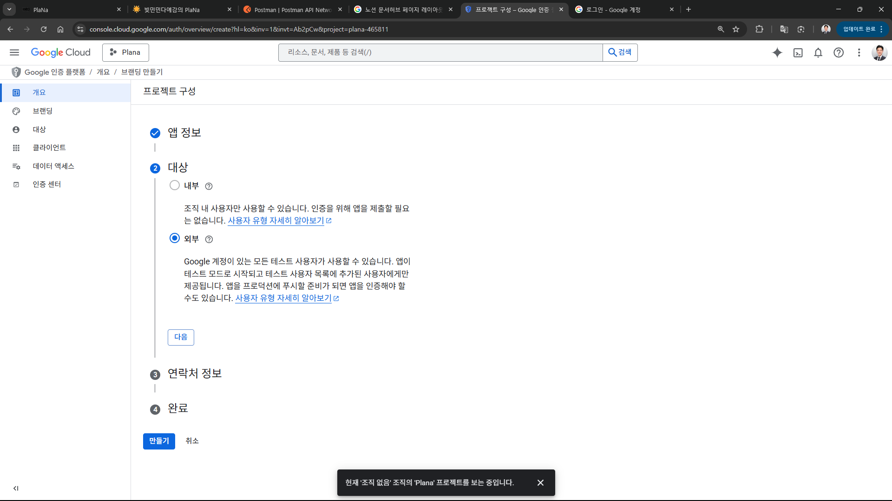
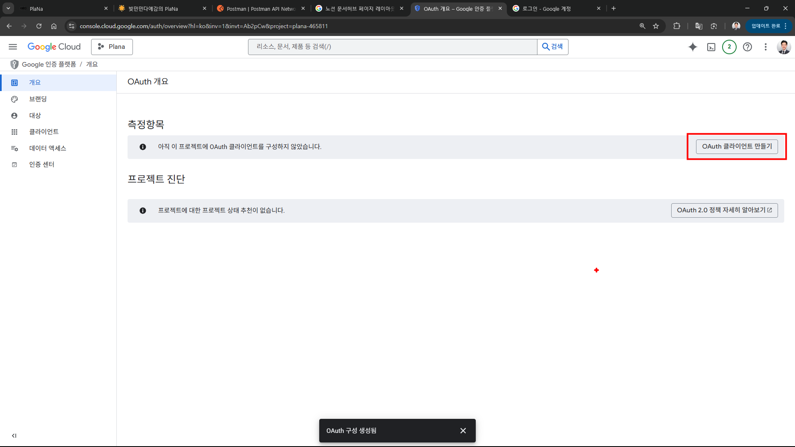
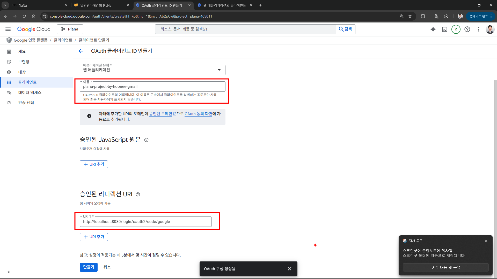
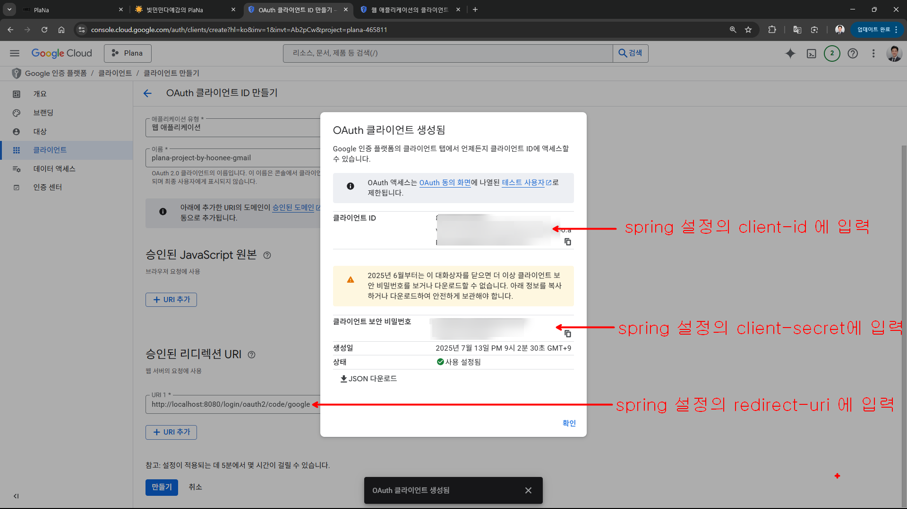

```properties
# =================================================================
# Google OAuth2 설정
# =================================================================
# Google OAuth2 클라이언트 ID (Google Cloud Console에서 발급)
spring.security.oauth2.client.registration.google.client-id=5번째_사진의_id값을_여기에_추가

# Google OAuth2 클라이언트 시크릿 (Google Cloud Console에서 발급)
spring.security.oauth2.client.registration.google.client-secret=5번째_사진의_secret값을_여기에_추가

# Google OAuth2 요청 스코프 (사용자 정보 범위)
spring.security.oauth2.client.registration.google.scope=profile,email

# Google OAuth2 리다이렉트 URI (백엔드 콜백 URL)
spring.security.oauth2.client.registration.google.redirect-uri=5번째_사진의_승인된_리디렉션_url을_여기에_추가
```